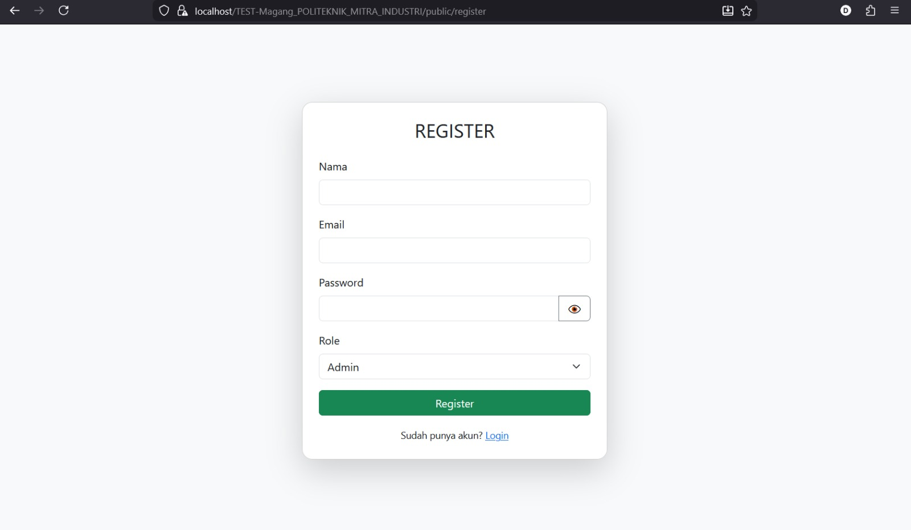
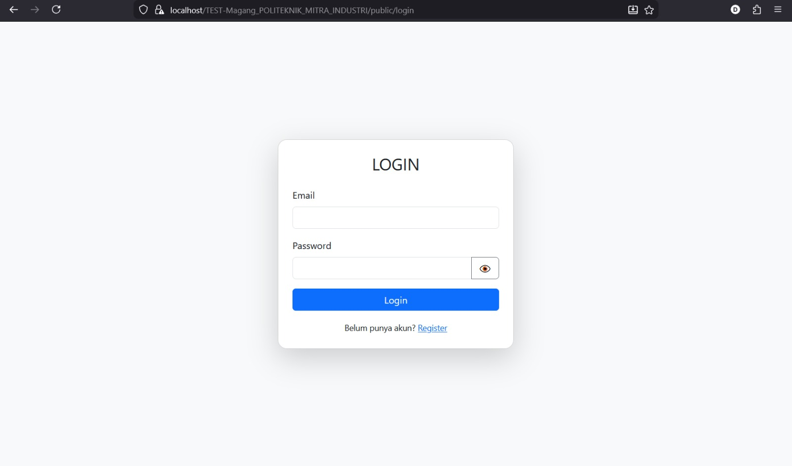
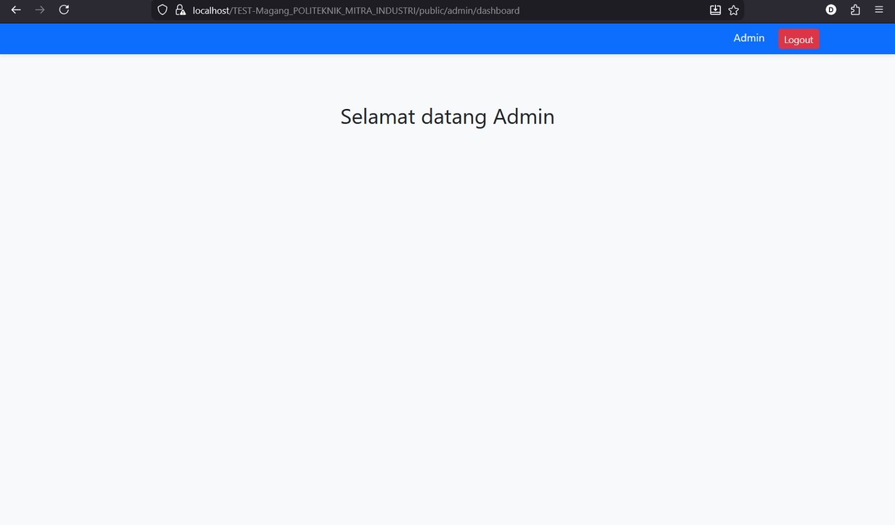
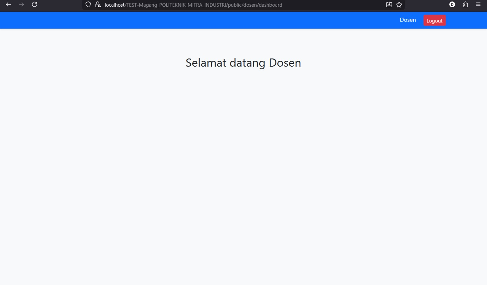
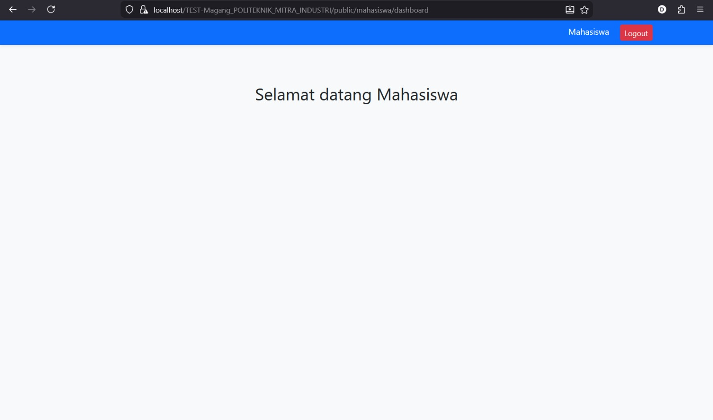
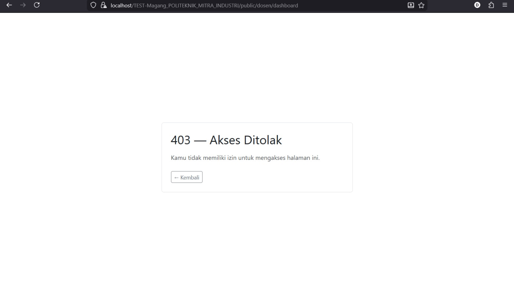
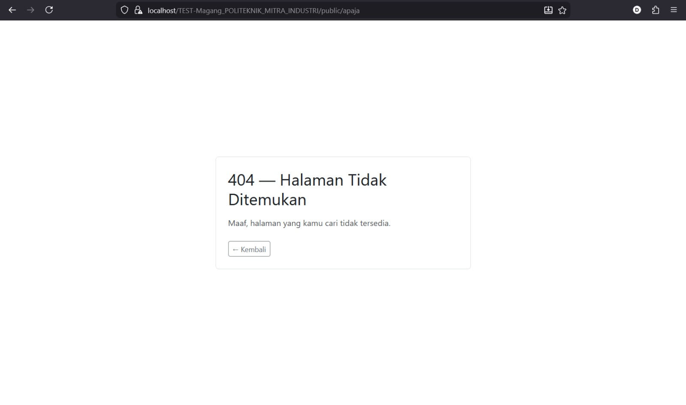

# TEST MAGANG POLITEKNIK — PHP Native MVC

Aplikasi mendukung fitur:

* Register user
* Login & Logout
* 3 Role akses:
  * Admin
  * Dosen
  * Mahasiswa

* Redirect dashboard sesuai role
* Proteksi halaman berdasarkan role
* Session login
* Password hashing

---

## Alat

| Komponen      | Versi            |
| ------------- | ---------------- |
| PHP           | 8.2.12           |
| Database      | MySQL            |
| Web Server    | Apache (XAMPP)   |
| CSS           | Bootstrap 5      |
| Arsitektur    | MVC (Native PHP) |

---


## Cara Setup Project

### 1️⃣ Clone / Copy Project

Letakkan folder project di:

```
C:\xampp\htdocs\
```

---

### 2️⃣ Import Database

1. Buka **phpMyAdmin**
2. Buat database baru:

```
db_(NAMA MENYESUAIKAN DENGAN YANG ADA DI config/koneksi.php)
```

3. Import file:

```
database.sql
```

---

### 3️⃣ Konfigurasi Database

Edit file:

```
APP/Config/koneksi.php
```

Sesuaikan dengan konfigurasi XAMPP:

```php
$host = "localhost";
$user = "root";
$pass = "";
$db   = "test_magang"; (GANTI SESUAI NAMA DATABASENYA)
```

---

### 5️⃣ Jalankan Aplikasi

Buka browser:

```
http://localhost/TEST-Magang_POLITEKNIK_MITRA_INDUSTRI/public
```

---

## List Akses Akun

| Role      | Email                                           |   Password   |
| --------- | ----------------------------------------------- | ------------ |
| Admin     | [Admin@gmail.com]                               | Admin123     |
| Dosen     | [Dosen@gmail.com]                               | Dosen123     |
| Mahasiswa | [Mahasiswa@gmail.com]                           | Mahasiswa123 |

---

## Screenshot Aplikasi

### Halaman Register



---

### Halaman Login



---

### Dashboard Admin



---

### Dashboard Dosen



---

### Dashboard Mahasiswa



---

### Bukti 403 Forbidden

Contoh: Mahasiswa mencoba mengakses dashboard Dosen.



---

### Bukti 404 Not Found



---

## Fitur Keamanan

* Password menggunakan `password_hash()`
* Session login
* Proteksi role access
* Validasi input form
* Prevent direct dashboard access

---

